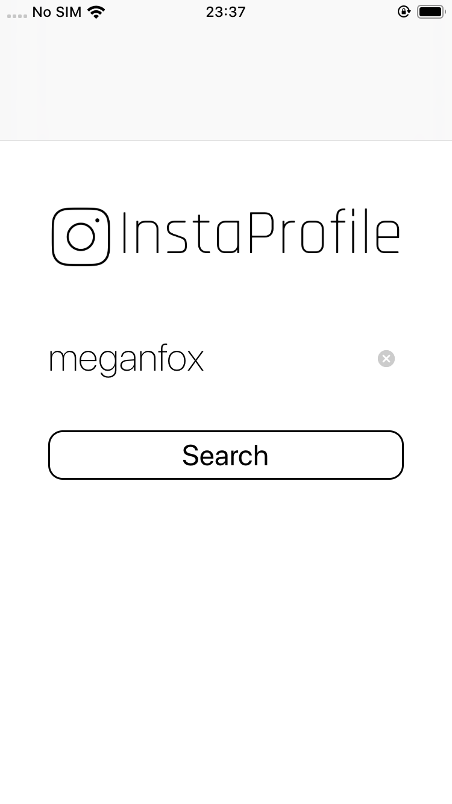
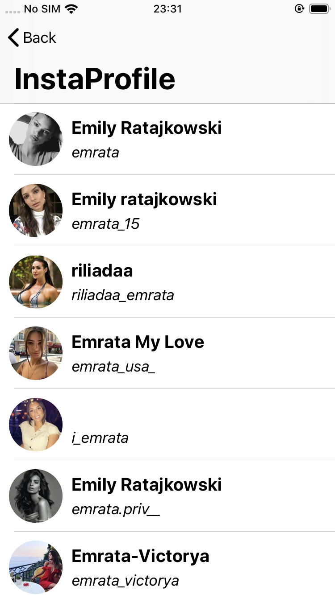
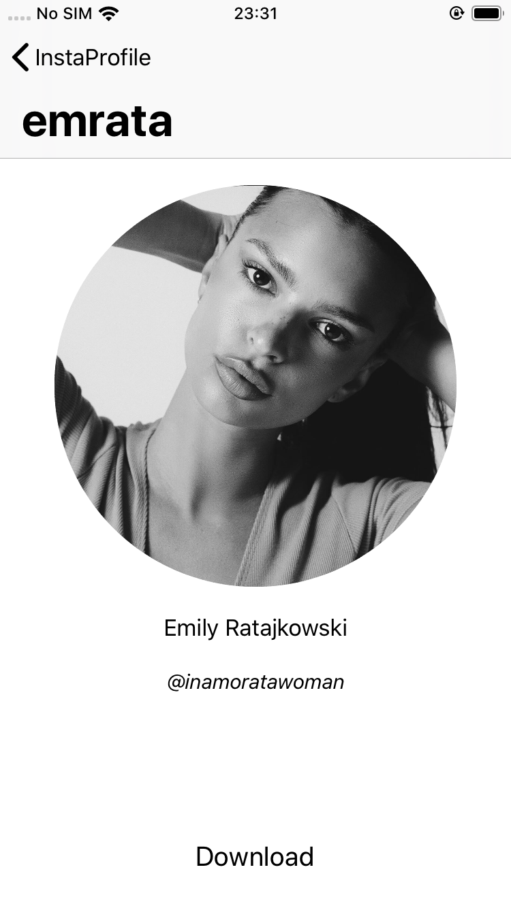

# InstaProfile
This is my first application, developed with the intent to learn a bit more about Objective-C. 

The application main goal is to access and download both instagram profile pictures and stories of users.

### Screenshots

### Todo
- Add some information about the user's profile on the profile view.
- Find a way to fetch stories of the user (external api's maybe?) and dispaly/download them.

